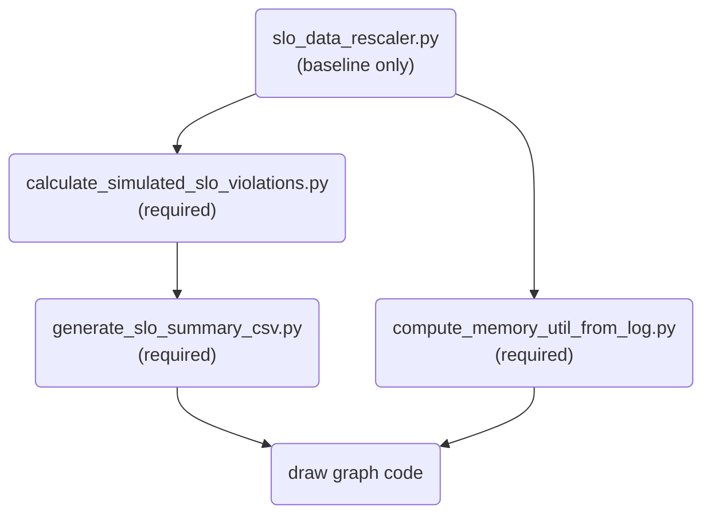

# 📊 OrbitFlow Result Pipeline

This repository provides a complete pipeline to **transform raw inference logs into structured data**, extract key performance metrics (e.g., SLO violations, arrival rates, token timings), and visualize the results.

The process is not just about plotting — it involves **multiple stages of data reprocessing, aggregation, and analysis**, designed to facilitate reproducible and insightful experiments.

## 1. ⚙️ Workflow Overview

The entire process follows this flow:



## 2. 📂 Common Data Parsing 

This part describes the common data parsing codes used in the raw data evaluation pipeline, including their purpose, usage, required inputs, and output behavior.

---

### 1. `slo_data_rescaler.py`

**Purpose**  
Generate results for different SLO (Service Level Objective) scales using already-run experiments (baseline-only).  
This is possible because baseline methods (e.g., `Flexgen`, `DistNSingle`) do not change internal decisions based on SLO thresholds.

⚠️ **Do not use this script for adaptive methods like `OrbitFlow`**, where scheduling decisions are affected by SLO.

**Example Usage**

```bash
  python ./data_analysis/data_parsing/slo_data_rescaler.py \
    --old-sc 2.5 \
    --new-sc-list 1 1.5 2 \
    --base-path "${base_path}" \
    --is-arrival \
    --arrival-rate-list 1 1.5 2 \
    --cv-list 2 \
    --methods DistNSingle Flexgen \
    --arrival-tpl "lambda{rate}x_cv{cv}"
````

**Arguments**

| Argument              | Description                                                 |
| --------------------- | ----------------------------------------------------------- |
| `--old-sc`            | Original SLO scale used in the existing experiment          |
| `--new-sc-list`       | New SLO scales to generate (e.g., 1, 1.5, 2)                |
| `--base-path`         | Base path containing the original experiment data           |
| `--is-arrival`        | Whether traces were created with arrival rate and CV rate   |
| `--arrival-rate-list` | List of experimented arrival rates       |
| `--cv-list`           | List of experimented cv rates                        |
| `--methods`           | List of experimented methods                  |
| `--arrival-tpl`       | Format of the trace tested(32k_lambda1.0x_cv1) |


###  2. `calculate_simulated_slo_violations.py`

**Purpose**
Calculate the number of SLO violations using per-token simulation logic.
This script calculates:

* SLO violations **with Token Deposit** (via simulation)
* SLO violations **without Token Deposit** (by threshold comparison)

Example Usage

```bash
    python ./data_analysis/data_parsing/calculate_simulated_slo_violations.py \
      <trace_dir1> <trace_dir2> ... \
      --reference-root /path/to/reference/jsons
```


**Arguments**

| Argument           | Description                                                        |
| ------------------ | ------------------------------------------------------------------ |
| `<trace_dirs>`     | List of directories containing `outputs.csv`                       |
| `--reference-root` | Path to the reference `.json` files used during request generation |


### 3. `generate_slo_summary_csv.py`

**Purpose**
Aggregate experiment-level metrics and generate a CSV file (`arrival_summerizev2.csv`) per method.

**Metrics computed**

* `tpot_attainment`: % of requests satisfying TPOT
* `tbt_attainment_with_TD`: Token-level SLO satisfaction (with TD)
* `tbt_attainment_no_TD`: Token-level SLO satisfaction (no TD)
* `throughput_tokens_per_sec`: Token throughput
* `slo_threshold_mean`: Mean of the SLO thresholds used
* `p90_ratio`, `p95_ratio`, `p99_ratio`: Tail latency percentiles (normalized)
* `req_per_sec`: Request frequency

**Example Usage**

```bash```
python ./data_analysis/data_parsing/generate_slo_summary_csv.py \
  <method_dir1> <method_dir2> ... \
  --reference-root /path/to/reference/jsons


**Arguments**

| Argument           | Description                                          |
| ------------------ | ---------------------------------------------------- |
| `<method_dirs>`    | List of method-level directories (e.g., `slo1/Ours`) |
| `--reference-root` | Path to reference trace `.json` files                |


### 4. `compute_memory_util_from_log.py`

**Purpose**
Compute memory utilization statistics from `outputs.log`.

**Output**
A CSV file named `mem_util_output.csv` per trace, containing:

* `used_num`, `total_num`

**Example Usage**

```bash
python ./data_analysis/data_parsing/compute_memory_util_from_log.py \
  <trace_dir1> <trace_dir2> ...
```

**Arguments**

| Argument       | Description                                  |
| -------------- | -------------------------------------------- |
| `<trace_dirs>` | List of directories containing `outputs.log` |


## 3. 🚀 Quick Start Example

See result_pipeline_script.sh
### Start to data parsing
```bash

# base_paths: Support for multiple experimental routes
base_paths=(
  # List of base directory containing experimental data
)
reference_root= {Path of the reference trace that ran the experiment}

# ───────────────────────────────────────────────
# Step 1. Change SLO scale Only For Baselines
# ───────────────────────────────────────────────
echo "📐 Recalculating SLO scale for baselines..."
for base_path in "${base_paths[@]}"; do
  python ./data_analysis/data_parsing/slo_data_rescaler.py \
    --old-sc {experimented slo scale} \
    --new-sc-list {list of new slo scales} \
    --base-path {base path} \
    --is-arrival \
    --arrival-rate-list {list of experimented arrival rates} \
    --cv-list {list of experimented cv scales} \
    --methods {list of experimented methods} \
    --arrival-tpl {Format of the trace}
done

# ───────────────────────────────────────────────
# Step 2. Collect all method/trace directories
# ───────────────────────────────────────────────
subdirs=(
# List of slo scales and methods for which you would like to see results
)

declare -a all_roots all_subdirs
 ....
```

### Draw graph
See draw_graph_script.sh

```bash
echo "Draw the picture you want"

python ./draw_graph/batch_size_graph.py \
  {Path where batch size was tested} \
  {Path where batch size 4 was experimented} \
  --output-dir {Path where you want to save the figure}

python ./draw_graph/cv_scale_graph.py \
  {Experimental path according to CV scale} \
  --output-dir {Path where you want to save the figure}

python ./draw_graph/fallback_strategy_graph.py \
  Path where the random selection results are saved \
  Path where the shortest selection results are saved \
  Path where the longest selection results are saved \
  --output-dir {Path where you want to save the figure}

python ./draw_graph/indivisual_component_token_deposit_graph.py \
  Path where design validation results are saved \
  Path where main results are saved \
  --output-dir {Path where you want to save the figure}

python ./draw_graph/p95_tbt_slo_attainment_gpu_utilization_graph.py \
  Path where main results are saved \
  --output-dir {Path where you want to save the figure}

python ./draw_graph/tbt_tpot_slo_attainment_graph.py \
  Path where main results are saved \
  --output-dir {Path where you want to save the figure}

python ./draw_graph/tp2_tp4_tbt_graph.py \
  Path where tp2 results are saved \
  Path where tp4 results are saved \
  --output-dir {Path where you want to save the figure}
```